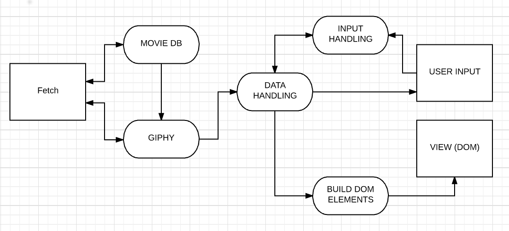

# week3-PAMF

## User Stories

As a movie enthusiast with some time on my hands, I want to be able to play a fun game and test my knowledge
> As a movie fan, I want to brush up on my movie knowledge

> I want to be able to play this on the move, as well as at home

> I want like to be able to get some clues when I'm stuck

> I want to be able to see the solution if I can't solve it

As a GIF lover, I want to explore meanings conveyed in GIFs whilst playing a fun game

> I'd like to see a variety of GIFs - not too many of the same ones

> I'd like to be able to guess possible meanings so I can get an idea of how to implement them later in my GIF-only chats with my GIF-loving friends

##### Accessibility

It makes sense for us to satisfy these user stories by creating a game that asks users to guess movies by serving them a series of GIFs. We've considered how we would make this accessible for a blind client but this will be out of the scope of this project.

Ideally, we would have an alternative game that presents a blind user with synonyms for each word in a movie title. For this project, however, we will ensure that sighted users who need to tab through the GIFs are able to do so.

## User Acceptance Criteria

- [ ] I can play simple game that **replaces all words within a movie title with GIFs**, asking me to **guess the movie title**.

- [ ] For each word in the title, I want to see three GIFs for some variety.

- [ ] I want the data to be pulled from the **Giphy and the Movie Database APIs**.

- [ ] I want to be able to **check which words are correct**, if necessary, so I can get some clues (some of the GIFs could be misleading).

- [ ] For some words that won't translate well into GIFs (e.g. 'the' and 'a'), I want to see the word in the answer from the outset, rather than seeing a GIF.

## Architecture

### Fetch

function fetch (url, callback) makes generic HTTP calls and outputs api data

### The Movie DB

function movieDB (callback) outputs an object with the name of a random popular movie.

### Giphy

function giphy ({ name:filmName }, callback) adds an array containing a set of 10 gif links per word to an object.

### Data Handling

function dataHandling ({ object }, callback) outputs an object with a string answer and an array of gif links like:
  {
    answer: "Example Title",
    clues: [
            ['gif 1 of Example', 'gif 2 of Example', 'gif 3 of Example'],
            ['gif 1 of Title', 'gif 2 of Title', 'gif 3 of Title']
           ]
  }
function checkResults (string) checks if the answer is correct;

### View (DOM)

function prepareForDom ({ handledDataObject }, callback) build DOM elements based on the object

### Input

function inputForm ((event) {
  gets form data and compares it to
  })

---

## Testing

We will aim to write simple and pure functions so we are able to test them easily.

We will use QUnit to test these functions.

## Stretch Goals

* Add **instructional example** on page load
* Add **other clues** such as movie rating, trivia etc.
* Add a user score that increments (e.g. 5 points for correct answer **without** clues, 3 points for correct answer **with** clues)
* Add ability to change the number of GIFs shown per word in order to alter the difficulty of the game
* Add the ability to **filter movies** by genre
